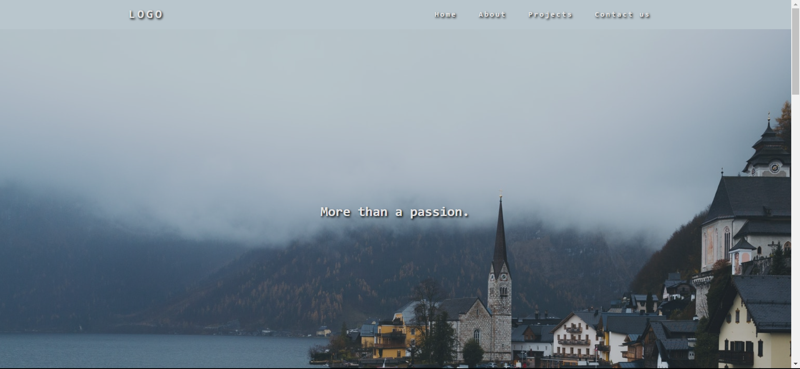

# Photographer-Portfolio

This is my first atempt at creating a portfolio website from scratch , using HTML , CSS and JavaScript. This project was a really good exercise for my front-end skills and mainly with the Flex. It also has a responsive navigation bar that is done with JavaScript.

It also has a carousel that is done with JavaScript.

